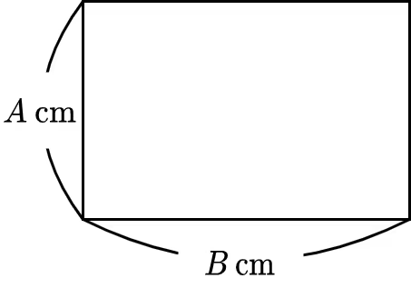

[문제 링크](https://www.acmicpc.net/problem/27323)

### 문제 설명

<p>정수 A, B 가 주어진다. 세로 길이가 A cm, 가로 길이가 B cm 인 아래와 같은 직사각형의 넓이를 cm² 단위로 구하시오.</p>



### 입력

<p>표준 입력에 다음과 같은 형태로 입력이 주어진다.</p>

```
A
B
```

### 출력

<p>세로 길이가 A cm, 가로 길이가 B cm인 직사각형의 넓이를 cm² 단위로 구하고, 단위 (cm²)를 생략하여 출력한다.</p>

### 제한

- 1 ≤ A ≤ 100.
- 1 ≤ B ≤ 100.
- A, B 는 정수이다.
